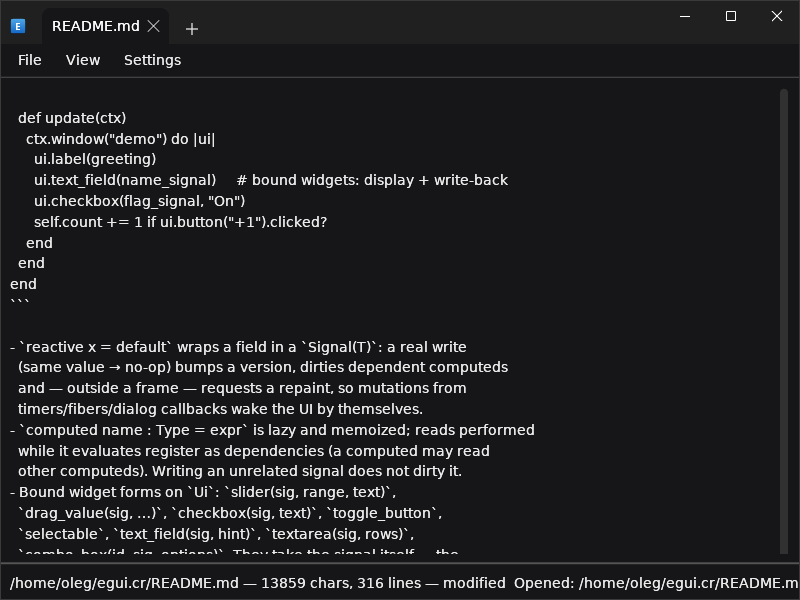
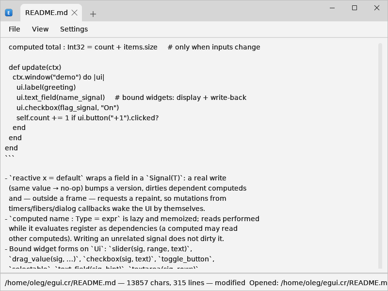
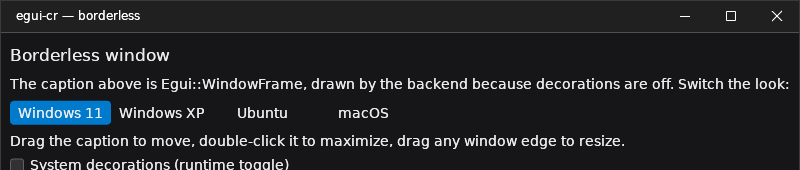
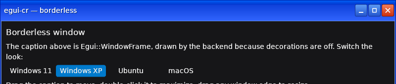
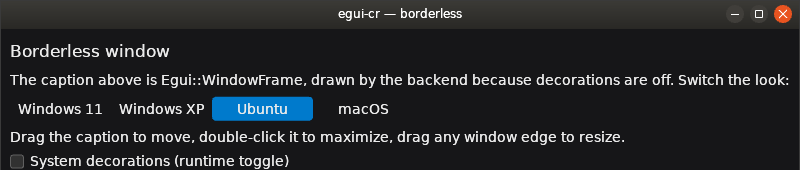
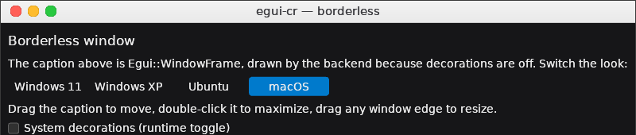
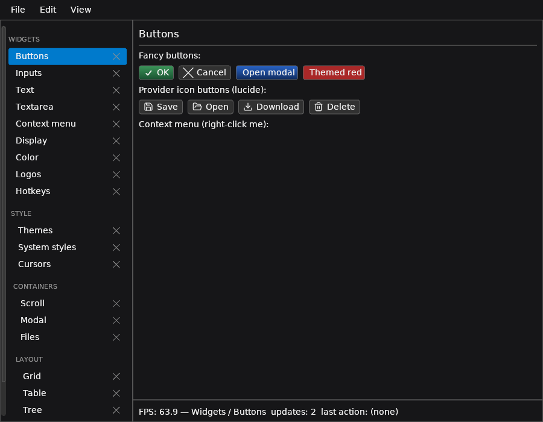
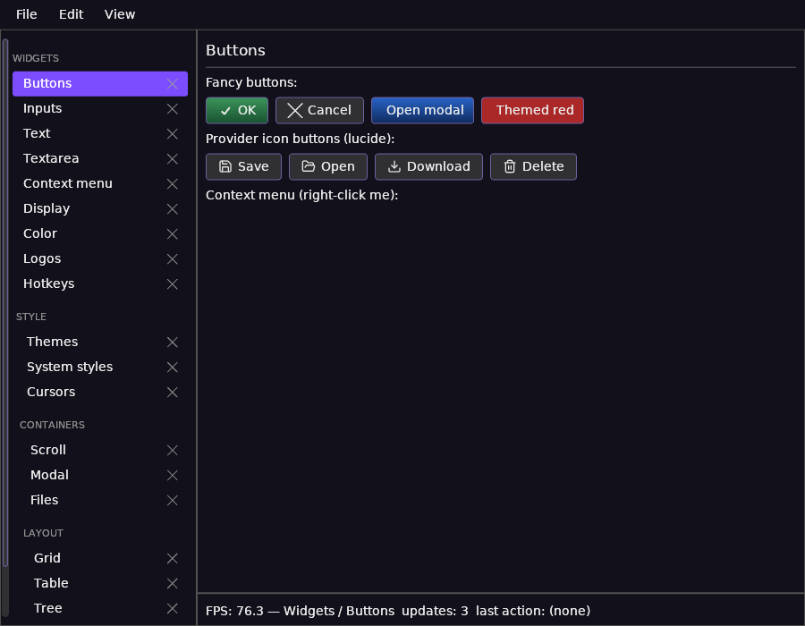
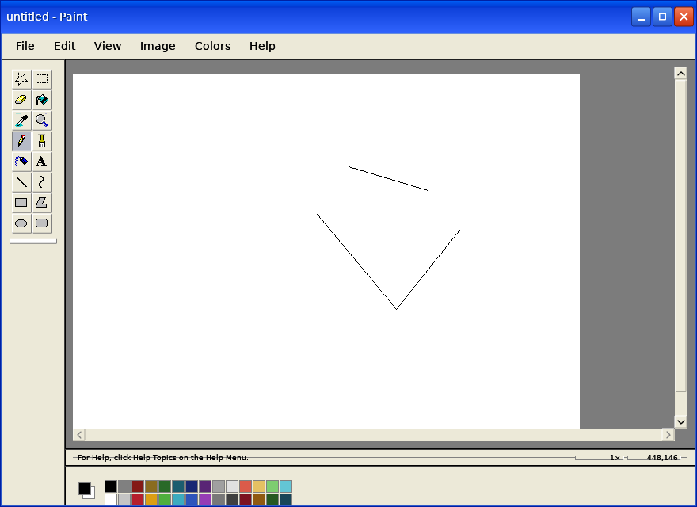

<!-- Generated by scripts/make_screenshots.py — do not edit;
     regenerate everything with: python3 scripts/make_screenshots.py -->

# egui-cr — demo

**Reactive, immediate-mode GUI for Crystal — pure Crystal UI.**
The only native dependency is the sokol_gfx backend; fonts render
through [freetype.cr](https://github.com/OrelSokolov/freetype.cr) and
SVG through [nanosvg.cr](https://github.com/OrelSokolov/nanosvg.cr) —
both pure Crystal.

## Notepad — tabbed editor, dark & light themes

Borderless window whose caption carries the tab strip; reactive tab
selection, routed settings/confirm pages, per-tab carets.

| Dark | Light |
|---|---|
|  |  |

## Borderless window frames

Client-side chrome drawn by `Egui::WindowFrame` — four looks, one
flag (`borderless --frame …`); drag to move, edge-drag to resize.

|  |
|---|
|  |
|  |
|  |

## Widget gallery — default & custom stylesheet

Every widget, twice: the built-in dark theme, then one custom
`ctx.stylesheet` theme (palette + cascade rules) restyling all of them
at once — no per-widget setup.

| Default dark | Custom stylesheet theme |
|---|---|
|  |  |

## Paint

Drawing app on the same core — WinXP chrome, canvas with brush strokes
and the text tool.

